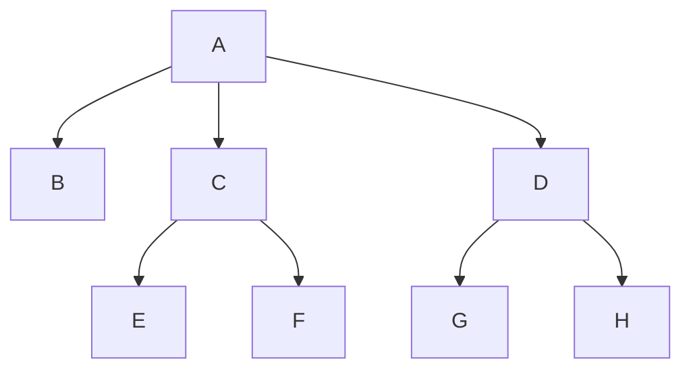

# Material information management
> A simple material information management program.
## Table of contents
* [General Info](#general-information)
* [Technologies Used](#technologies-used)
* [Screenshots](#screenshots)
* [Room for Improvement](#room-for-improvement)
* [Setup](#setup)
* [Acknowledgements](#acknowledgements)

## General Information
Α program that will manage material information. Costs for the supply of raw materials will be calculated and the production of intermediates and
final products in order to satisfy some orders.
The distinction of materials into categories
follows the following rules:

- Raw materials
- Intermediate products[^1]
- Final products

## Screenshots

## Room for Improvement

## Technologies Used
C Integrated Development Environment (IDE)

## Setup
Basic project for language learning.  
External text input 
## Acknowledgements
- This project was one of my very first project when i was learning C.
- This project was created for the requirements of the lesson Introduction to Computers.

[^1]: Intermediate products can be an intermediate composition..
